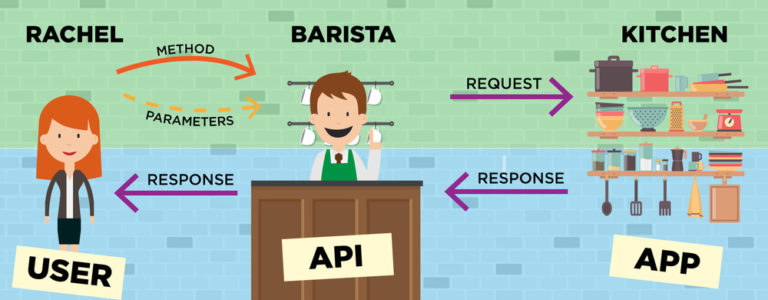

## Framework Spring Boot

 Testando os métodos HTTP (GET, PUT, POST E DELETE) com o framework Spring Boot. 
Aula da Gama Academy em parceira com a IBM no programa de treinamento If Black The Code. Prof. Isidro.

 

## O que é Spring Boot? 

O Spring Boot é um framework Java open source que tem como objetivo facilitar esse processo em aplicações Java. 
Consequentemente, ele traz mais agilidade para o processo de desenvolvimento, uma vez que devs conseguem reduzir
o tempo gasto com as configurações iniciais.
 

Link para download do Spring Boot
[clique aqui](https://spring.io/)  

 

## O que é API? 

API significa Application Programming Interface (Interface de Programação de Aplicação). No contexto de APIs, 
a palavra Aplicação refere-se a qualquer software com uma função distinta. A interface pode ser pensada como um 
contrato de serviço entre duas aplicações.
 

## Métodos de requisição HTTP

Requisições HTTP são mensagens enviadas pelo cliente para iniciar uma ação no servidor. Suas linhas iniciais 
contêm três elementos: Um método HTTP, um verbo (como GET , PUT ou POST ) ou um nome (como HEAD ou OPTIONS ), 
que descrevem a ação a ser executada..
 

 

<dl>
<dt>.GET</dt>
<dd>O método GET solicita a representação de um recurso específico. Requisições utilizando o método GET devem 
retornar apenas dados.</dd>
<dt>.PUT</dt>
<dd> O método PUT substitui todas as atuais representações do recurso de destino pela carga de dados da requisição.</dd>
<dt>.DELETE</dt>
<dd> O método DELETE remove um recurso específico.</dd>
<dt>.POST</dt>
<dd> O método POST é utilizado para submeter uma entidade a um recurso específico, frequentemente causando uma 
mudança no estado do recurso ou efeitos colaterais no servidor.</dd>
</dl>

